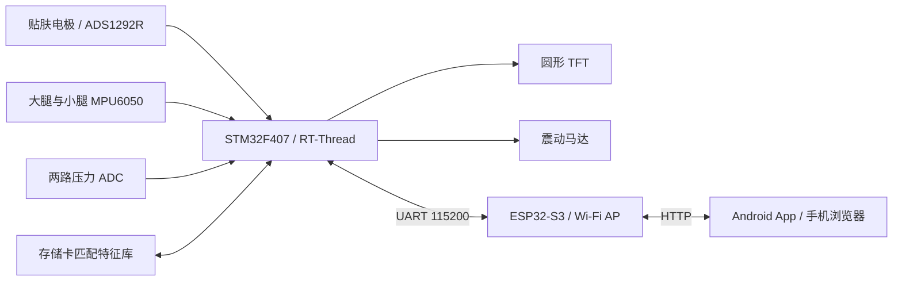

# 防损伤智能肌肉护膝（RT-Thread）

基于 STM32F407VET6、ADS1292R、MPU6050 和 RT-Thread 的可穿戴运动状态反馈原型。护膝由电池独立供电，板端负责肌电处理、动作计数、疲劳评分、圆屏显示和震动反馈，ESP32-S3 将状态转发到手机。

本次整理日期：**2026-10-06**。板端以本次提供的 `test_pro3_v8_dbui_kneeout (1).zip` 为准，不再使用初始开源版板端代码。[版本对应关系与校验值](docs/VERSIONS.md)

## 快速找到需要的文件

| 需要什么 | 入口 | 说明 |
| --- | --- | --- |
| 护膝主控工程 | [STM32 工程](firmware/rt-thread-studio-project/) | 可导入 RT-Thread Studio，包含内核、HAL/CMSIS 和链接脚本 |
| ESP32 无线固件 | [KneePad_ESP32_AP.ino](firmware/esp32/KneePad_ESP32_AP/KneePad_ESP32_AP.ino) | 本次指定的 v1.3.2，使用 Wi-Fi 热点与 HTTP |
| 手机安装包 | [下载 Android v1.2.4 APK](software/android/releases/SmartKneePad-v1.2.4-emg-contact-action-latch.apk?raw=true) | 原 `.apk.1` 文件仅恢复为 `.apk` 后缀，内容不变 |
| 手机开发源码 | [Android v1.5.0 源码](software/android/source-v1.5.0/) | 来自压缩包，比提供的安装包版本新；不是 v1.2.4 的对应源码 |
| 运行匹配库 | [特征库与查询脚本](data/runtime_matching/) | CSV、SQLite、标准化参数及板端兼容表 |
| 历史采集与训练 | [Python 工具](software/pc_tools_and_training/) | 保留初始开源版本的采集、训练和验证资料 |
| 接线与安装 | [复现指南](docs/REPRODUCE.md) | STM32、ESP32、手机、存储卡的使用顺序 |
| 通信字段 | [通信协议](docs/PROTOCOL.md) | KNEE、PRESS 和手机 HTTP 接口 |

## 系统结构



## 当前板端功能

- 肌电：500 Hz 采样设计，256 点窗口、64 点步进；滤波、静息/主动基线校准、RMS、MAV、WL、ZC、SSC 等特征处理。
- 疲劳：板端随机森林与特征评分，结合相似样本匹配结果形成反馈。模型数据位于 `fatigue_rf_model.c`，匹配逻辑位于 `fatigue_db.c`。
- 动作：20 ms 周期读取 MPU6050，状态机处理下降、底部、上升与回正；区分深蹲、硬拉和步行，输出动作质量与电极接触状态。
- 姿态：当前由两颗 MPU6050 的相对方向变化判断内扣/外扩。压力原始值仍可采集，但 `DP_POSTURE_SOURCE_IMU=1`、`MOTION_USE_PRESSURE_FEATURES=0`，压力不决定最终姿态结论。
- 显示：TFT 线程间隔 80 ms，疲劳数字显示最近约 1 秒的最大值；无线状态间隔 500 ms。

**当前源码保留了演示/私下测试用的疲劳处理**：前 1-13 次可压低高分；27-34 次之间可选取随机动作次数强制产生高分序列。它会影响显示和报警，不能把该流程当作自然疲劳识别准确率证据。此次只整理原文件，没有更改算法。[具体逻辑](docs/DEMO_BEHAVIOR.md)

当前总训练次数包含已结束但分类为 `UNKNOWN` 的动作，因此不保证“总次数 = 深蹲次数 + 硬拉次数”；步行采用独立计数。该行为与早期 V8 不同。

## 目录说明

```text
firmware/
  rt-thread-studio-project/   STM32 工程、RT-Thread 内核与芯片支持源码
  esp32/KneePad_ESP32_AP/     ESP32 v1.3.2 Arduino 工程
  releases/                  原归档内提供的 STM32 二进制
software/
  android/releases/          Android v1.2.4 安装包
  android/source-v1.5.0/      Android v1.5.0 开发源码
  pc_tools_and_training/     原有上位机、训练与验证工具
data/
  runtime_matching/          本次加入的运行匹配数据库
  sample_capture/            原有示例采集数据
  training_curated/          原有训练特征与模型
docs/
  VERSIONS.md                各端版本、来源和 SHA-256
  REPRODUCE.md               安装、编译、接线与调试
  PROTOCOL.md                串口与 HTTP 协议
  DEMO_BEHAVIOR.md            当前测试用疲劳逻辑
  source-notes/              原工程历史说明，可能包含过期参数
```

## 版本与验证范围

推荐按本次提供的 **STM32 源码 + ESP32 v1.3.2 + Android v1.2.4 APK** 使用 Wi-Fi 链路。Android v1.5.0 开发源码另含 BLE 和 AI 建议功能；本次 ESP32 固件未实现 BLE 服务，不能仅凭手机端有蓝牙按钮就认为蓝牙链路可用。

本次校验了来源哈希、APK 内部版本、文件完整性、匹配库结构及串口/HTTP 字段，并保持各端程序内容不变。没有重新烧录硬件或验证实机表现。原归档的 JDK、SDK、Gradle 缓存、编译目录、签名私钥和个人运行日志未上传。

项目使用 Apache-2.0；第三方 RT-Thread、HAL/CMSIS 等组件保留其原版权与许可证，详见 [开源说明](docs/OPEN_SOURCE_NOTES.md)。
